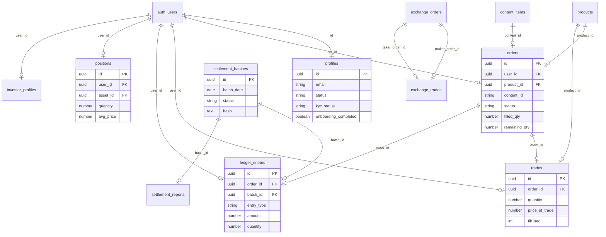
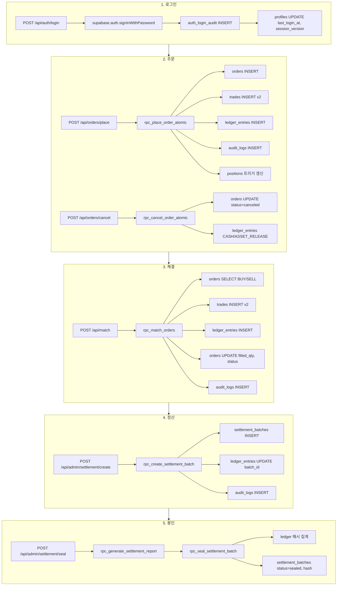

# HANBANG Platform — 프로젝트 전체 분석 보고서

> 생성일: 2026.03.21  
> 분석 범위: DB 구조, API 흐름, 상태 머신

---

## 1️⃣ DB 구조 시각화

### 1.1 모든 테이블 목록 및 주요 컬럼

| 테이블 | 주요 컬럼 | 비고 |
|--------|-----------|------|
| **profiles** | id, email, nickname, role, status, balance, kyc_status, onboarding_completed, last_login_at, session_version, force_logout_at | 유저 프로필 |
| **orders** | id, user_id, content_id, product_id, type, order_type, price, quantity, filled_quantity, status, idempotency_key, filled_qty, remaining_qty, avg_fill_price_krw, locked_cash_krw, locked_asset_qty, canceled_at | 주문 (content 기반) |
| **trades** | id, order_id, user_id, product_id, price_at_trade, quantity, amount, type, fill_seq, subtotal_krw, fee_krw, total_krw, realized_pnl_krw | 체결 |
| **ledger_entries** | id, user_id, order_id, trade_id, entry_type, currency, amount, asset_id, quantity, batch_id, row_hash, prev_hash, memo, metadata | 원장 (불변) |
| **positions** | id, user_id, asset_id, quantity, avg_price, total_cost, realized_pnl, avg_price_krw | 포지션 |
| **settlement_batches** | id, batch_date, status, hash, created_at | 정산 배치 |
| **settlement_reports** | id, batch_id, report, created_at | 정산 리포트 |
| **audit_logs** | id, user_id, action, ref_type, ref_id, metadata, created_at | 감사 로그 |
| **exchange_orders** | id, user_id, asset_id, side, order_type, price, quantity, status, idempotency_key | 거래소 주문 |
| **exchange_trades** | id, asset_id, maker_order_id, taker_order_id, maker_user_id, taker_user_id, price, quantity | 거래소 체결 |
| **investor_profiles** | id, user_id, kyc_status, grade, investment_limit | 투자자 프로필 |
| **auth_login_audit** | id, user_id, email, ip_address, success, event_type, failure_reason, created_at | 로그인 감사 |
| **content_items** | id, title, product_id, share_price_usd, thumbnail_url, youtube_video_id | 콘텐츠 |
| **products** | id, title, seller_id | 상품 |
| **user_onboarding_status** | user_id, completed_at, skipped, updated_at | 온보딩 완료 |
| **onboarding_channels** | id, name, thumbnail_url | 온보딩 채널 |
| **user_interest_ratings** | user_id, channel_id, rating | 채널 별점 |
| **revenue_events** | id, content_id, gross_amount, status | 수익 이벤트 |
| **revenue_distributions** | id, event_id, user_id, amount | 수익 분배 |
| **positions_snapshot_daily** | id, snap_date, user_id, item_id, qty, avg_price_krw | 일일 포지션 스냅샷 |

### 1.2 Foreign Key 관계

```
auth.users (id)
  ├── profiles (id)
  ├── orders (user_id)
  ├── trades (user_id)
  ├── ledger_entries (user_id)
  ├── positions (user_id)
  ├── investor_profiles (user_id)
  └── auth_login_audit (user_id)

orders (id)
  ├── trades (order_id)
  └── ledger_entries (order_id)

settlement_batches (id)
  ├── ledger_entries (batch_id)
  └── settlement_reports (batch_id)

products (id)
  ├── orders (product_id)
  └── trades (product_id)

content_items (id)
  └── orders (content_id)
```

### 1.3 RPC 함수 목록 및 참조 테이블

| RPC | 참조 테이블 | 용도 |
|-----|-------------|------|
| **rpc_place_order_atomic** | orders, trades, ledger_entries, content_items, audit_logs | 주문+체결 원자 처리 |
| **rpc_place_order_limit** | orders, content_items | placed 전용 주문 |
| **rpc_match_orders** | orders, trades, ledger_entries, positions, content_items, audit_logs | BUY/SELL 매칭 |
| **rpc_cancel_order_atomic** | orders, ledger_entries | 주문 취소 + HOLD 해제 |
| **rpc_create_settlement_batch** | settlement_batches, ledger_entries, audit_logs | 정산 배치 생성 |
| **rpc_generate_settlement_report** | ledger_entries, settlement_reports | 정산 리포트 생성 |
| **rpc_seal_settlement_batch** | settlement_batches, ledger_entries | 정산 봉인 (hash) |
| **rpc_snapshot_positions_daily** | positions, positions_snapshot_daily | 일일 스냅샷 |
| **fn_round_krw** | - | KRW 라운딩 |
| **fn_fee_krw** | - | 수수료 계산 |
| **fn_update_position_on_ledger** | positions, ledger_entries | 포지션 트리거 |
| **prevent_ledger_update** | ledger_entries | 원장 불변 트리거 |
| **rpc_exchange_place_order** | exchange_orders, exchange_trades, ledger_entries | 거래소 주문 |
| **rpc_exchange_cancel_order** | exchange_orders, ledger_entries | 거래소 취소 |
| **fn_match_order** | exchange_orders, exchange_trades, ledger_entries | 거래소 매칭 |
| **rpc_distribute_revenue** | revenue_events, revenue_distributions, ledger_entries | 수익 분배 |
| **get_random_onboarding_channels** | onboarding_channels | 온보딩 채널 랜덤 |

### 1.4 ER 다이어그램 (Mermaid)



---

## 2️⃣ API 흐름 트리

### 2.1 로그인 → 주문 → 체결 → 정산 → 봉인 흐름



### 2.2 API Route → RPC/테이블 매핑

| API Route | HTTP | RPC | 테이블 |
|-----------|------|-----|--------|
| /api/auth/login | POST | - | auth_login_audit, profiles |
| /api/orders/place | POST | rpc_place_order_atomic | orders, trades, ledger_entries |
| /api/orders/cancel | POST | rpc_cancel_order_atomic | orders, ledger_entries |
| /api/match | POST | rpc_match_orders | orders, trades, ledger_entries, positions |
| /api/admin/settlement/create | POST | rpc_create_settlement_batch | settlement_batches, ledger_entries |
| /api/admin/settlement/seal | POST | rpc_generate_settlement_report, rpc_seal_settlement_batch | settlement_batches, ledger_entries |
| /api/admin/settlement/finalize | POST | rpc_generate_settlement_report, rpc_seal_settlement_batch (seal로 리다이렉트) | settlement_batches, ledger_entries |
| /api/exchange/* | GET/POST | (관리자 전용) rpc_exchange_place_order 등 | exchange_orders, exchange_trades |
| /api/orders/sell | POST | rpc_sell_content | ledger_entries, positions |
| /api/onboarding/complete | POST | - | user_onboarding_status, profiles |
| /api/admin/kyc/approve | POST | - | profiles (kyc_status) |
| /api/wallet/balance | GET | - | ledger_entries, positions |
| /api/orders/my | GET | - | orders |

### 2.3 파일별 요약 (주요 API)

| 파일 | 역할 |
|------|------|
| `app/api/auth/login/route.ts` | 로그인, audit 기록, profiles 갱신 |
| `app/api/orders/place/route.ts` | rpc_place_order_atomic 호출 |
| `app/api/orders/cancel/route.ts` | rpc_cancel_order_atomic 호출 |
| `app/api/match/route.ts` | rpc_match_orders 호출 |
| `app/api/admin/settlement/create/route.ts` | rpc_create_settlement_batch 호출 |
| `app/api/admin/settlement/seal/route.ts` | rpc_generate_settlement_report + rpc_seal_settlement_batch |
| `app/api/admin/settlement/finalize/route.ts` | seal로 리다이렉트 (rpc_generate_settlement_report + rpc_seal_settlement_batch) |
| `app/api/exchange/*` | 관리자 전용 (requireAdmin). place, cancel, orderbook, my-orders, trades, dividend-info |

---

## 3️⃣ 상태 머신 정리

### 3.1 orders.status

| 현재 상태 | 다음 상태 | 전이 조건 |
|-----------|-----------|-----------|
| placed | partial | rpc_match_orders로 부분 체결 (remaining_qty > 0) |
| placed | filled | rpc_place_order_atomic 즉시 전량 체결 또는 rpc_match_orders 전량 체결 |
| placed | canceled | rpc_cancel_order_atomic 호출 |
| partial | filled | rpc_match_orders로 잔량 전량 체결 |
| partial | canceled | rpc_cancel_order_atomic 호출 |
| filled | - | 최종 (변경 불가) |
| canceled | - | 최종 (변경 불가) |

**허용 값:** `placed`, `partial`, `filled`, `canceled`

### 3.2 settlement_batches.status

| 현재 상태 | 다음 상태 | 전이 조건 |
|-----------|-----------|-----------|
| open | sealed | rpc_seal_settlement_batch 호출 성공 |
| sealed | - | 최종 (변경 불가) |

**허용 값:** `open`, `sealed`

### 3.3 profiles.kyc_status

| 값 | 설명 | 전이 |
|----|------|------|
| pending | KYC 미완료 | 초기값 |
| approved | KYC 승인 | POST /api/admin/kyc/approve |
| rejected | KYC 반려 | 관리자 반려 |

### 3.4 profiles.onboarding_completed

| 값 | 설명 | 전이 |
|----|------|------|
| false | 온보딩 미완료 | 초기값 |
| true | 온보딩 완료 | POST /api/onboarding/complete |

### 3.5 profiles.status (유저 라이프사이클)

| 현재 상태 | 다음 상태 | 전이 조건 |
|-----------|-----------|-----------|
| NEW | KYC_REQUIRED | 최초 가입 |
| KYC_REQUIRED | KYC_SUBMITTED | KYC 제출 |
| KYC_SUBMITTED | KYC_APPROVED | 관리자 승인 |
| KYC_SUBMITTED | KYC_REQUIRED | 관리자 반려 |
| KYC_APPROVED | ONBOARDING_REQUIRED | KYC 승인 후 |
| ONBOARDING_REQUIRED | ACTIVE | 온보딩 완료 |
| * | SUSPENDED | 관리자 정지 |

### 3.6 exchange_orders.status (거래소)

| 현재 상태 | 다음 상태 | 전이 조건 |
|-----------|-----------|-----------|
| OPEN | PARTIALLY_FILLED | fn_match_order 부분 체결 |
| OPEN | FILLED | fn_match_order 전량 체결 |
| OPEN | CANCELED | rpc_exchange_cancel_order |
| PARTIALLY_FILLED | FILLED | fn_match_order 잔량 체결 |
| PARTIALLY_FILLED | CANCELED | rpc_exchange_cancel_order |

---

## 4️⃣ 중복/위험/충돌 경고

### settlement_batches 스키마 (호환 패치 적용됨)

20260321000100_settlement_batches_compat_fix.sql 적용 후에는, settlement_date/finalized_at 기반 테이블이든 batch_date/status/hash 기반 테이블이든 모두 호환되도록 컬럼이 보강되며, RPC는 batch_date를 정식 컬럼으로 사용한다.

### 정산 플로우 (단일화됨)

Finalize는 폐기되었고, finalize endpoint는 seal로 리다이렉트된다. 정산 확정은 seal 단일 플로우.

### Exchange 엔진 상태

- exchange_orders / exchange_trades는 내부 실험용 엔진.
- 외부 사용자 API 접근 차단 (requireAdmin 적용).
- 정식 거래 엔진은 orders / trades 시스템.
- 향후 범용 거래소 확장 시 재활성화 가능.

### ledger 정책 확정

- ledger는 모든 금융 이벤트의 불변 원장.
- 거래형(entry_type TRADE_*)은 반드시 order_id 필요.
- 수익/입금/배당은 order_id NULL 허용.
- 정산 대상은 order_id IS NOT NULL + 거래형만 포함.

### ⚠️ types.ts와 마이그레이션 불일치

- `lib/supabase/types.ts`가 실제 마이그레이션보다 많은 컬럼을 가정할 수 있음.
- `supabase gen types` 재실행 권장.

---

## 5️⃣ 파일 요약

| 카테고리 | 개수 | 경로 |
|----------|------|------|
| 마이그레이션 | ~35 | supabase/migrations/*.sql |
| API Route | ~118 | app/api/**/route.ts |
| RPC 함수 | ~20+ | migrations 내 create or replace function |

### 주요 마이그레이션 순서

1. `20260216120000` - profiles, investor_profiles, channels
2. `20260217000000` - ledger_entries 무결성
3. `20260217200001` - positions
4. `20260217200003` - settlement_batches (freeze)
5. `20260217310000` - exchange_orders, exchange_trades
6. `20260301094000` - orders 상태 머신, trades fill_seq
7. `20260301095000` - rpc_place_order_atomic (부분체결)
8. `20260301101000` - rpc_cancel_order_atomic
9. `20260301110000` - rpc_match_orders, rpc_place_order_limit
10. `20260301140000` - audit_logs, settlement_batches (status, hash), rpc_seal
11. `20260301150000` - settlement_reports, rpc_create_settlement_batch, rpc_generate_settlement_report
12. `20260321000100` - settlement_batches 호환 패치 (batch_date, settlement_date, status 등 통일)
13. `20260321000110` - rpc_create_settlement_batch, rpc_seal_settlement_batch 호환 수정
14. `20260321000200` - ledger_entries.order_id NOT NULL + FK 강제
15. `20260321000210` - exchange RPC ledger 기록 차단 (EXCHANGE_LEDGER_BLOCKED)
16. `20260321000300` - ledger order_id NULL 허용 복구, entry_type 기반 CHECK 제약
17. `20260321000310` - 정산 RPC 거래형만 대상 (order_id IS NOT NULL)

---

## 6️⃣ types 재생성 (마이그레이션 적용 후)

정산 스키마 변경 후 `lib/supabase/types.ts`를 DB와 동기화하려면:

```bash
supabase gen types typescript --project-id <프로젝트_ID> --schema public > lib/supabase/types.ts
```

또는 `supabase/README.md`에 정의된 프로젝트별 명령어 사용.

- 재생성 후 `pnpm build` 또는 `npm run build` 1회 실행하여 타입 검증.
